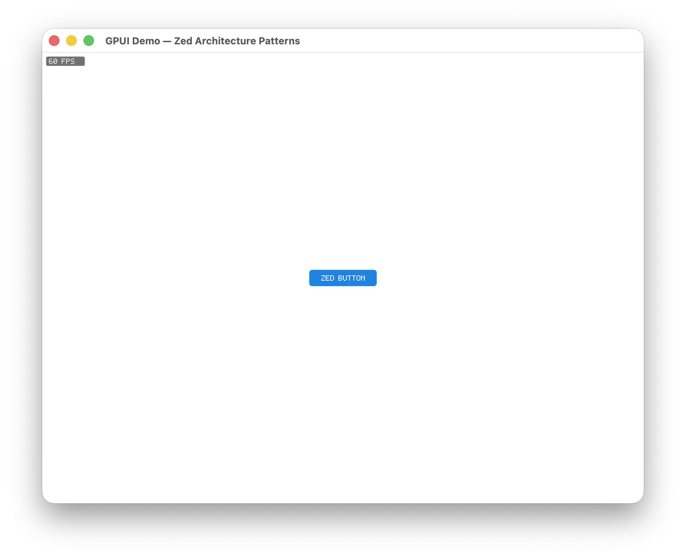

# GPUI Demo

A minimal Rust + Metal UI demo inspired by Zed's GPUI architecture.



## Overview

This demo opens a macOS window with a GPU-rendered button and FPS overlay. It shows the core UI flow used by GPUI-style systems:

```text
Element Tree -> Layout -> Prepaint -> Paint -> Scene -> Metal Renderer
```

## Highlights

- Metal instanced quad rendering
- SDF rounded rectangles and borders
- Simple flexbox-style layout
- Interactive button hover and press states
- VSync-driven render loop with `CVDisplayLink`
- Small module structure modeled after Zed GPUI concepts

## Run

Requires macOS with Metal support.

```bash
cargo run
```

## Main Modules

- `element`, `div`, `button`, `text` - UI elements
- `layout`, `style`, `geometry` - layout and styling primitives
- `scene`, `renderer`, `shaders` - rendering pipeline
- `metal_view`, `display_link` - macOS window and render loop

